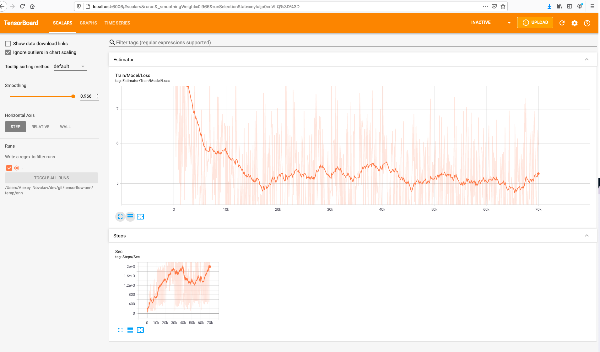

# Tensorflow_Scala Example

Model training using [eaplatanios/tensorflow_scala](https://github.com/eaplatanios/tensorflow_scala) library.

## Code

Multiple Linear Regression: [src/main/scala/tensorflow/tutorial/MultipleLR.scala](src/main/scala/tensorflow/tutorial/MultipleLR.scala)

## Run OSX

```bash
sbt run
```

## Run Linux or other OS

Go to `build.sbt` and change `tensorflow` library classifier, from "darwin" 
to your platform. Available classifiers today can be looked here: 
[https://repo1.maven.org/maven2/org/platanios/tensorflow_2.13/0.5.10/](https://repo1.maven.org/maven2/org/platanios/tensorflow_2.13/0.5.10/)

```diff
-"org.platanios" %% "tensorflow" % tensorFlowScalaVer classifier "darwin"
+"org.platanios" %% "tensorflow" % tensorFlowScalaVer classifier "linux"
```

Then run sbt:

```bash
sbt run
```

## Tensorboard

Install `tensorboard` via pip: 

```bash
pip install tensorboard
```

Then open it at [http://localhost:6006](http://localhost:6006)



